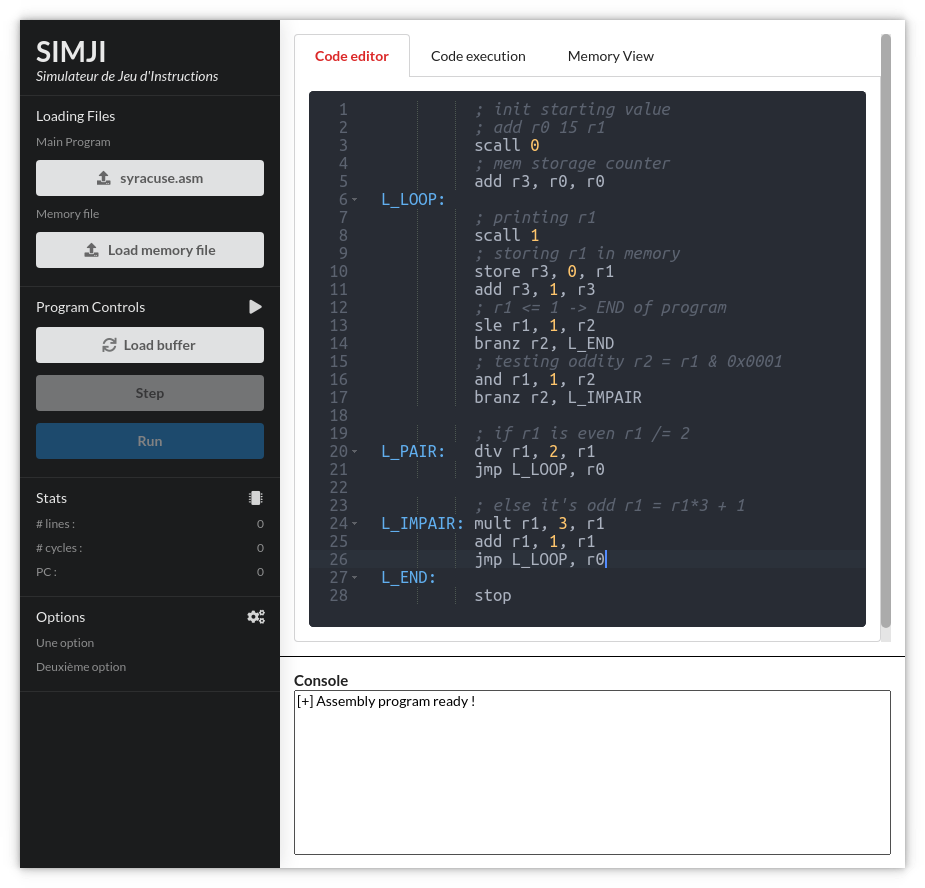

# SIMJI - **SIM**ulateur de **J**eu d'**I**nstructions

<div align="center">

<a href="https://codecov.io/gh/NightlySide/SIMJI"></a>
<a href="https://codeclimate.com/github/NightlySide/SIMJI/maintainability"></a>
<a href="https://goreportcard.com/report/github.com/Nightlyside/SIMJI"></a>
<a href="https://pkg.go.dev/github.com/Nightlyside/simji#section-directories"></a>
</div>

<p align="center">

</p>

<h4 align="center">SIMJI is a powerful and fast instruction set simulator (ISS) made in <a href="https://github.com/golang/go">Golang</a> that assemble and run MIPS-assembly programs using a convienient and simple CLI or GUI.</h4>

## Table of contents

[**Features**](#features)

[**Installation**](#installation)

-   [**From Sources**](#from-sources)
-   [**From a released archive**](#from-released-archive)

[**Usage**](#usage)

-   [**Assembly**](#assembly)
-   [**Disassembly**](#disassembly)
-   [**Virtual Machine**](#virtual-machine)
-   [**Graphical User Interface**](#graphical-user-interface)

[**Project motivations**](#project-motivations)

## Features

-   Fast Virtual Machine (5 000 000 it/sec in average)
-   Assemble MIPS-assembly files in binary
-   Graphical User Interface integrated to debug and try new code
-   Open source project

## Installation

### From sources

First step you need to install Golang.

#### Linux

Depending on your distribution :

```bash
sudo apt install go # Debian based distro
sudo pacman -S go # Arch based distro
```

#### Windows

Install Go using the graphical installer from the [official download page](https://golang.org/dl/).

Then check that go is working from the command line

```bash
go version # should print something
```

Then clone the project :

```bash
git clone https://github.com/NightlySide/SIMJI.git
cd SIMJI
```

Then build the project :

```bash
make # using the make file
go build . # building only using go
```

> Warning: If you build from sources using only the `go build .` command, the static files for the GUI will not be bundled in the executable  
> In order to include those files you need first to package them into a go file using : `go run github.com/markbates/pkger/cmd/pkger`

Once the build is done (should not take more than several seconds) you can use the simulator using the command line :

```bash
chmod +x simji
./simji -h
```

### From a released archive

Go to the [release page](https://github.com/NightlySide/SIMJI/releases) and download the latest release for your operating system.

Then cd into the folder were you placed the binary file :

```bash
cd Downloads/ # For example
chmod +x simji
./simji -h
```

## Usage

Excepting the GUI, you will always need to put a path to a file for the sim to work. Or else you will be facing this message :


### Assembly

For the following examples we will take this simple assembly programs that puts the number 15 in the first register and prints its value on screen :

```asm
; program.asm
add r0, 15, r1
scall 1
stop
```

In order to assemble a program into binary instructions you need to use the `--assemble` flag :

```bash
# Will print the instructions in the terminal
./simji --assemble program.asm
```

You may save the instructions in a binary file as well using the `--output` flag :

```bash
# Will save the content in a file
./simji --assemble --output program.bin program.asm
```

The content of the binary file should look like that :

```
0x00000000	0x082001e1
0x00000001	0x90000001
0x00000002	0x00000000
```

### Disassembly

The same way you can disassemble a binary file using the `--disassemble` flag :

```bash
./simji --disassemble program.bin
```

Which should print something like that in the terminal :

```
[+] INFO: No output file specified. Printing binary to console.
add r0, 15, r1
scall 1
stop
```

And likewise you can save the output to an external file using the `--output` flag.

### Virtual Machine

(W.I.P.)

### Graphical User Interface

The graphical user interface (GUI) is made using the [Lorca](https://github.com/zserge/lorca) library. For this part to work you need to have Chrome or Chromium browser installed. In fact Lorca is working like electron but instead of shipping a whole instance of chromium, it uses the one installed on your system to keep the footprint of the app small.

To start the GUI you need to provide the `--gui` or `-g` flag.

In that case all other flags are ignored :

```bash
./simji --gui
./simji -g # does the same thing
```

Using this command will brind the GUI :



On the other tabs you can follow the execution of the program step by step and on the last tab you can monitor how each register and each memory block is used.


From this interface you can load the program into the buffer (the editor in the GUI) where you can edit the code with syntax highlighting.

Once you are happy with the program click the "Load Buffer" button which will send the program contents to the simulator for execution.

The you can execute the program step by step or do a full run.

## Documentation

The documentation is available here: [https://pkg.go.dev/github.com/Nightlyside/simji](https://pkg.go.dev/github.com/Nightlyside/simji#section-directories).

You might need to expand the directories in order to follow the documentation for each package making this project.

## Project motivations

At first this project was due for a class on Numeric Architectures at the [ENSTA Bretagne](https://www.ensta-bretagne.fr/en) Engineering School. I then took it further than what was required to pass the topic.

<div align="center">
    
</div>

I chose to develop this project using Golang because I wanted to try something new, to be able to put another new tech or language to my range of skills and tools.

I wanted to insist on test coverage for this project as it always seems to be something little worked in a project.

I am quite proud of the result for a first project made in Golang and I will be happy to make something different with this language.
