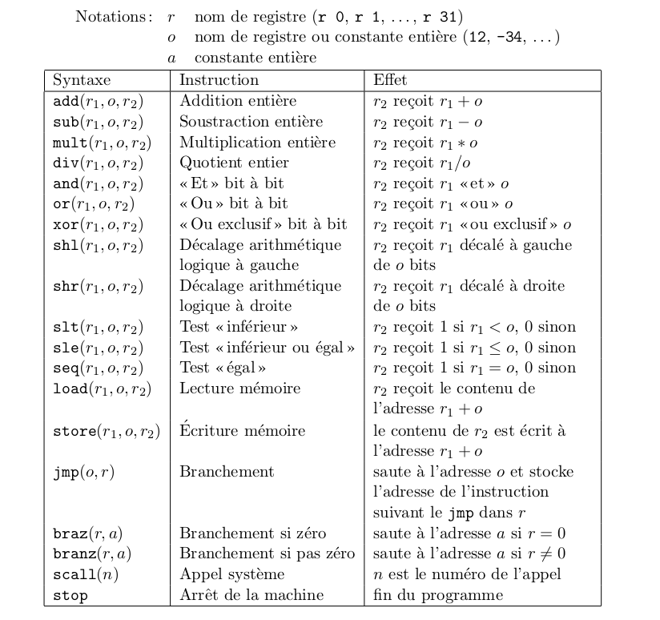
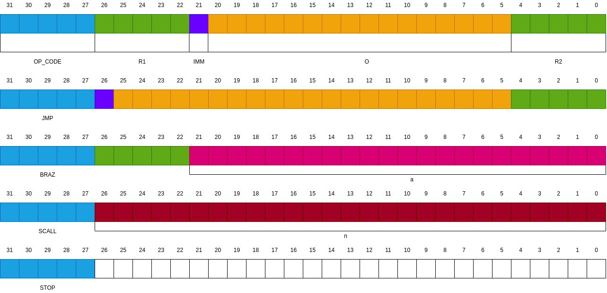
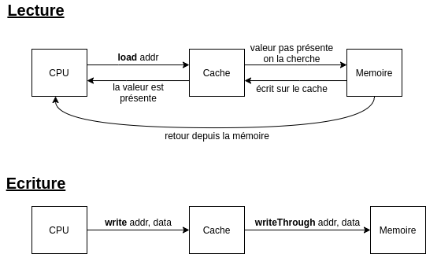
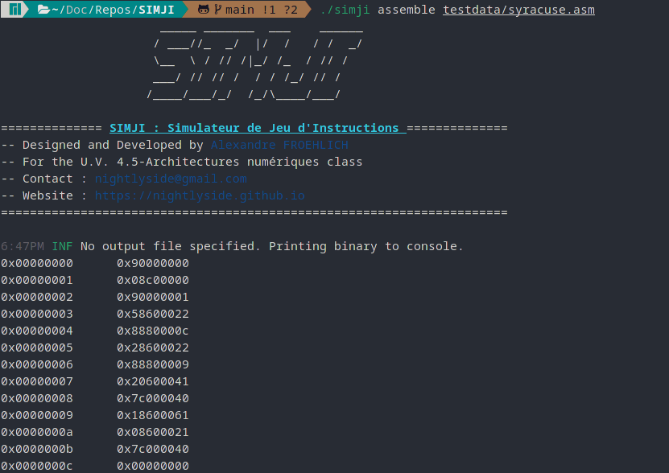
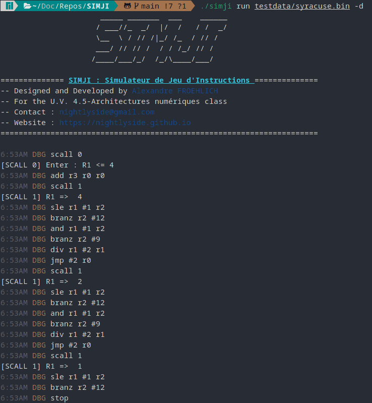
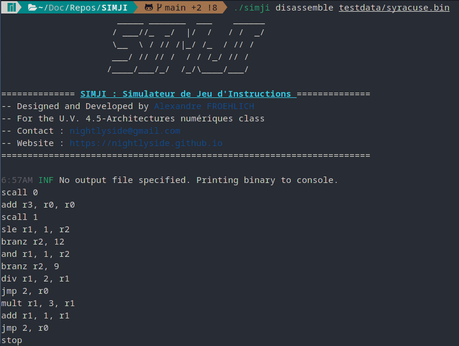
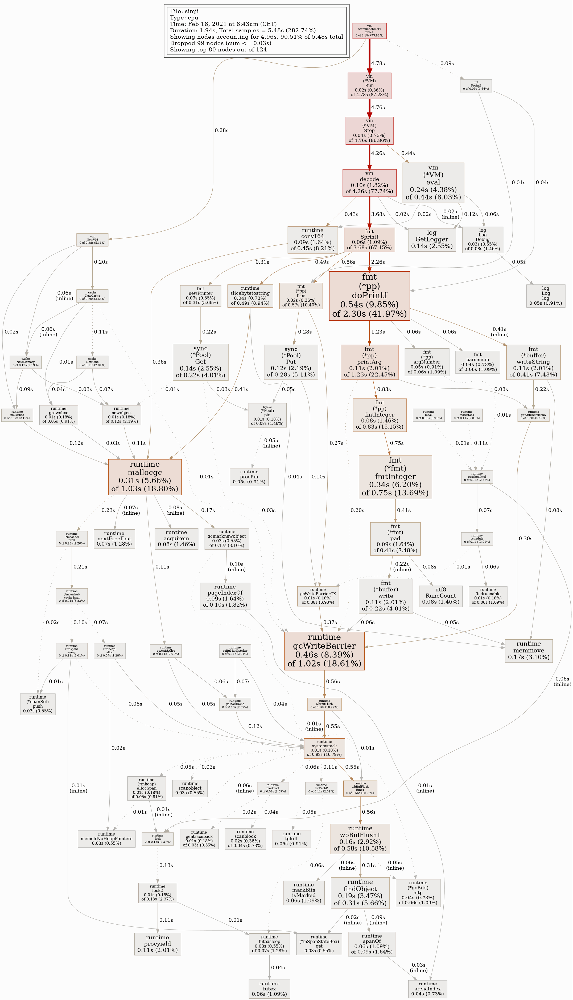
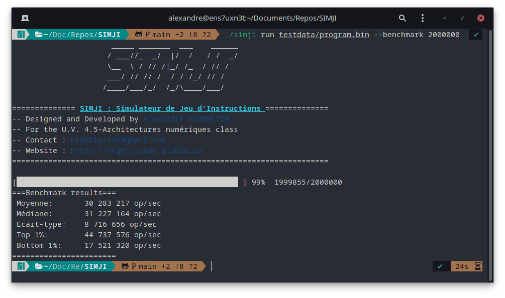
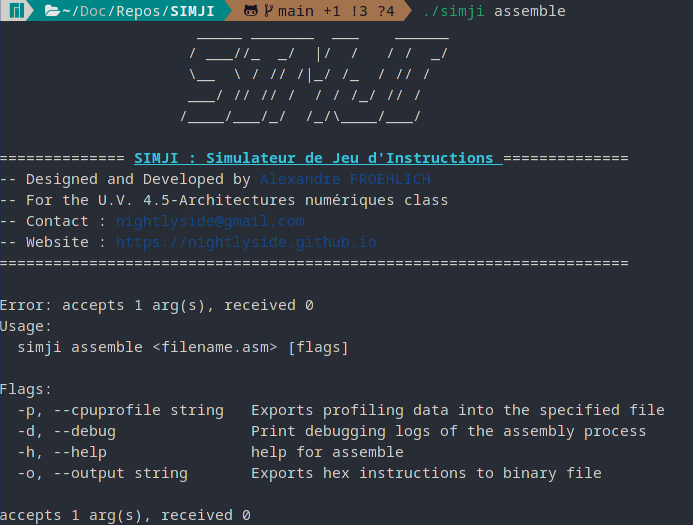
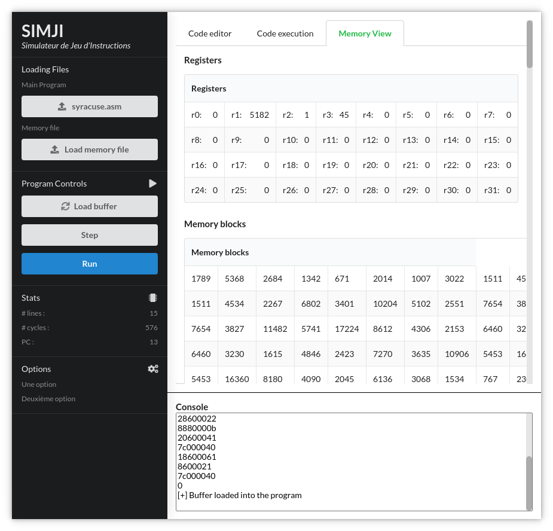

# Introduction

Nous sommes entourés de machines de Turing. Des automates qui agissent et réagissent à la moindre requête qu'on leur soumet. Il serait intéressant de revenir au base et de comprendre comment, à _bas niveau_ un ordinateur est capable d'interpréter une série de commandes qu'un programmeur lui donne : le programme.

## Motivation

SIMJI est un simulateur de jeu d'instruction développé dans le cadre de mes études à l'[ENSTA Bretagne](https://www.ensta-bretagne.fr/fr). L'enseignant nous laissant le choix du langage j'ai décidé d'utiliser ce projet pour sortir de ma zone de confort et me tourner vers un langage plus "_moderne_", j'ai donc choisi le [Golang](https://golang.org/).

{ width=50% }

## Objectifs

Les objectifs principaux de ce projet sont les suivants :

-   découvrir l'architecture des processeurs
-   découvrir la compilation des langages

A cette fin nous avons réalisé un simulateur de jeu d'instruction se décomposant en plusieurs sous-programmes :

-   **un programme d'assemblage** permettant de prendre un programme rédigé en mini-MIPS et sortant des instructions machine
-   **un simulateur d'instructions** prenant ces instructions machines et exécutant le stack

# Architecture et langage

## Les registres

Le CPU (Compute Processing Unit) est une puce de silicone contenant, aujourd'hui, des milliards de transistors faisant passer ou non un signal électrique. Afin de traiter des calculs plus complexes que ceux effectués par les portes logiques que représentent ces transistors, il est intéressant de stocker les résultats obtenus.

C'est ici qu'interviennent les registres. Les registres sont des espaces mémoires d'accès extrêmement rapide en comparaison des disques durs classiques. Ils sont en nombre limités mais permettent de stocker temporairement des valeurs provenant du processeur.

## Les instructions

Pour que le programmeur puisse donner des ordres à la machine il doit écrire une série d'instructions. Nous allons pour ce projet nous baser sur le jeu d'instructions suivant, similaire au jeu [MIPS](https://fr.wikipedia.org/wiki/Architecture_MIPS) :

{ width=70% }

Pour se simplifier le travail, on va supposer que l'architecture du processeur que nous allons simuler est de 32 bits. Ainsi chacune des instructions sera elle même encodée sur 32 bits. On va ensuite pouvoir réserver chacun de ces bits pour une fonctionnalité donné :

-   4 bits pour l'opcode : le type d'instruction
-   5 bits pour chaque adresse de registre
-   1 bit pour indiquer si la valeur qui suit est immédiate ou bien un registre
-   16 bits pour la valeur immédiate ou bien l'adresse de registre

{ width=90% }

Cependant l'expression en binaire de ce code est bien trop lourde. On lui préférera l'écriture hexadécimale qui permet de ne pas perdre en informations tout en rendant l'écriture plus lisible.

Par exemple si nous souhaitons ajouter $5$ au registre `r1` l'instruction correspondante en assembleur est :

```asm
add r1, 5, r1
```

Qui se traduit alors en instruction machine par : `0110 1000 0110 0000 0000 0000 1010 0001` ou bien en hexadécimal `0x686000a1`.

On peut tout de suite mieux comprendre l'intérêt d'une telle écriture.

## La mémoire et le cache

J'ai parlé précédemment des registres. Cependant les registres étant en nombre limité, il faut trouver un autre moyen pour stocker l'information.

Pour cela le jeu d'instructions mini-MIPS nous fournit des instructions `load` et `store` pour manipuler ces valeurs dans la mémoire. Cependant leur accès reste bien plus lent, en témoigne le tableau suivant donnant le nombre de cycles nécessaires pour accéder à l'information en fonction de l'endroit où elle est stockée :

| Type              | Taille des données   | Nombre de cycles |
| ----------------- | -------------------- | ---------------: |
| Registre          | 4 octets = 32 bits   |                0 |
| Cache             | 64 octets            |                1 |
| Mémoire virtuelle | pages de 4kB         |              100 |
| Disque dur        | secteurs de disque   |          100 000 |
| Stockage réseau   | morceaux de fichiers |       10 000 000 |

Pour cela on implémente un _cache_ qui va enregistrer une donnée dans un espace mémoire plus rapide si elle est utilisée plus fréquemment afin d'améliorer les performances du système.

Dans ce projet on ne va s'intéresser qu'à l'implémentation d'un cache à correspondance directe. Dans ce cas chaque `set` du cache ne contient qu'une ligne. On peut alors résumer le fonctionnement du cache par le schéma suivant :

{ width=80% }

# L'assembleur

> Un assembleur est un programme d'ordinateur qui traduit un programme écrit en langage assembleur — essentiellement, une représentation mnémonique du langage machine — en code objet.  
> -- Wikipedia

L'assembleur est un outil qui prend en entrée des instructions rédigées en assembleur et qui les traduit en code compréhensible par la machine.

Dans ce projet nous devrons être capable d'interpréter les instructions du jeu mini-MIPS. De plus le langage doit pouvoir supporter les labels qui seront des références dans le programme pour la gestion de tout ce qui est "saut" dans le code.

Pour se faire il faut procéder de la manière suivante :

1. Récupérer le texte correspondant au programme
2. Séparer le texte en ensemble de lignes
3. Parcourir une première fois les lignes et récupérer les adresses des labels
4. Parcourir une seconde fois les lignes :
    1. Remplacer les références de labels par leur adresse
    2. Traduire les arguments par des codes
5. "Assembler" les codes des arguments en une instruction hexadécimale

Nous allons voir chacune des étapes précédentes et expliquer les quelques spécificités ou diffcultés encontrées.

## Manipulation de fichier

En golang, la manipulation des fichiers se réalise à l'aide d'une bibliothèque standard "outil". Une autre spécificité du langage est la gestion des erreurs. Ces derniers se manipulent comme des variables : on tente une action et on récupère la présence d'erreur ou non dans une variable. Si cette variable est non nulle, il y a eu une erreur et on peut agir en conséquences.

```go
// OpenFile ouvre un fichier et retourne ses lignes
// sous la forme d'un tableau
func OpenFile(filename string) string {
	content, err := ioutil.ReadFile(filename)
	// si il y a eu une erreur durant l'ouverture
	if err != nil { panic() }

	// on sépare les lignes obtenues dans le fichier
	lines := strings.Split(string(content), "\n")
	for i := range lines {
		lines[i] = strings.TrimSpace(lines[i])
	}

	return lines
}
```

## Adresses des labels

La prochaines étape est de parcourir l'ensemble des lignes du programme pour trouver les labels et stocker leur adresse dans un dictionnaire. Pour cela golang possède un type standard : la map. On peut ainsi définit le type des clés ainsi que le type des valeurs : `var dictionnaire map[string]int`.

Pour détecter un label on doit d'abord être capable de détecter qu'une ligne n'est pas un commentaire ou bien une ligne vide :

```go
// EstVideOuCommentaire retourne vrai si la ligne est
// un commentaire ou bien est vide
func EstVideOuCommentaire(ligne string) bool {
	// si la ligne est vide on retourne vrai
	if ligne == "" { return true }

	// on sépare la ligne en arguments
	args := strings.Split(ligne, " ")

	// on vérifie si la ligne entière est un commentaire
	return args[0][0] == ";"
}
```

Ensuite une ligne définissant un label commence soit par le label, ou bien le label compose la ligne. Il suffit alors de vérifier que le premier mot finisse par `:` pour s'assurer de la définition d'un label :

```go
// ExtraitLabel retourne le label si il existe dans une ligne
func ExtraitLabel(ligne string) string {
	// on sépare la ligne en arguments
	args := strings.Split(ligne, " ")

	// on vérifie si le premier mot est un label
	if args[0][len(args[0])-1] != ":" { return "" }

	// on extrait le label
	return args[0][:len(args[0])-1]
}
```

Il ne reste alors plus qu'à parcourir le programme pour définir un dictionnaire des adresses des labels :

```go
// AdressesLabels construit un dictionnaire contenant
// les adresses des labels
func AdressesLabels(lignes []string) map[string]int {
	var adresses map[string]int
	var pc int

	for _, ligne := range lignes {
		// si la ligne n'est pas viable
		if !EstVideOuCommentaire(ligne) { continue }

		label := ExtraitLabel(ligne)
		// si il y a un label on enregistre son adresse
		if label != "" { adresses[label] = pc }
		pc++
	}

	return adresses
}
```

{ width=60% }

## Traduction des instructions en codes

Cette étape est la plus importante, en terme d'efforts, dans l'assembleur. Il va falloir itérer sur chacune des lignes et traduire chaque argument en code qui sera ensuite traduit en hexadécimal.

On peut commencer en concevant une fonction permettant de dire si un argument est un registre et si oui quel est son numéro de registre. Pour cela golang nous permet de retourner plusieurs valeurs qui ne sont pas du même type, un peu comme python. Cela se déclare dans la signature de la fonction :

```go
// EstUnRegistre permet de parser un argument et de dire si c'est un registre
func EstUnRegistre(argument string, labels map[string]int) (int, bool) {
	// on retire le "r" du registre si il est présent
	if argument[0] == 'r' {
		// on essaie de parser l'argument
		value, err := strconv.Atoi(argument[1:])
		// si il y a une erreur c'est un mauvais registre
		if err != nil {
			panic("Error while parsing register: ", argument)
		}
		return value, true
	}

	// si il s'agit d'un label on retourne son adresse
	if value, ok := labels[argument]; ok {
		return value, false
	}

	// on essaie de parser l'argument
	value, err := strconv.Atoi(argument)
	// si il a une erreur c'est qu'on ne sait pas quelle est cette valeur
	if err != nil {
		panic("Error while parsing immediate: ", argument)
	}

	// sinon on a réussi à parser la valeur
	return value, false
}
```

On est maintenant capable de comprendre chaque argument séparément en traduisant les adresses des labels et en séparant les registres des valeurs immédiates. Il ne reste plus qu'à traduire les instructions.

Pour information voici les codes associés à chaque type d'instruction :

```go
var OpCodes = map[string]int{
	"stop":   0,	"add": 	  1,
	"sub": 	  2, 	"mul": 	  3,
	"div": 	  4, 	"and": 	  5,
	"or": 	  6, 	"xor": 	  7,
	"shl":    8, 	"shr": 	  9,
	"slt":   10, 	"sle":   11,
	"seq":   12, 	"load":  13,
	"store": 14, 	"jmp":   15,
	"braz":  16, 	"branz": 17,
	"scall": 18,
}
```

{ width=60% }

## Traduction des codes en hexadécimal

C'est la dernière étape de l'assemblage. Il faut maintenant récupérer les codes et les assembler dans une instruction unique sur 32 bits. Pour cela on va s'aider des décalages binaires.

En golang les décalages binaires sont identique au C. On utilise pour cela les chevrons doubles : `<<`. Enfin pour reconstruire l'instruction on peut créer une fonction qui va respecter les règles que j'ai décrit au chapitre sur les instructions :

```go
func TraductionHexa(inst []int) int {
	decInstr := instr[0] << 27

	// on fait un switch sur le nombre d'arguments
	switch len(instr) {
	case 1:
		break
	case 2:
		// scall
		decInstr += instr[1] // num
		break
	case 3:
		// braz
		decInstr += instr[1] << 22 // reg
		decInstr += instr[2]       // address
	case 4:
		// jmp
		decInstr += instr[1] << 26                      // imm
		decInstr += BinaryComplement(instr[2], 21) << 5 // o
		decInstr += instr[3]                            // r
	case 5:
		// add, load, store ...
		decInstr += instr[1] << 22                      // reg
		decInstr += instr[2] << 21                      // imm
		decInstr += BinaryComplement(instr[3], 16) << 5 // o
		decInstr += instr[4]                            // reg
		break
	}

	return decInstr
}
```

On a utilisé ici une fonction maison permettant d'écrire un nombre entier signé en nombre binaire en complément à 2. Voici son implémentation :

```go
// BinaryComplement permet de calculer le complément à 2 d'un entier
func BinaryComplement(number int, size int) int {
	// aucun travail à faire
	if number >= 0 { return number }

	return (1 << (size - 1)) - number
}
```

## Exemple

Pour le programme suivant, permettant de calculer les termes de la suite de syracuse, on a le programme en assembleur :

```asm
          ; initialise valeur de début
          ; add r0 15 r1
          scall 0
          ; compteur pour stockage mémoire
          add r3, r0, r0
L_LOOP:
          ; on affiche r1
          scall 1
          ; r1 <= 1 -> fin du programme
          sle r1, 1, r2
          branz r2, L_END
          ; on teste la parité r2 = r1 & 0x0001
          and r1, 1, r2
          branz r2, L_IMPAIR

          ; si r1 est pair r1 /= 2
L_PAIR:   div r1, 2, r1
          jmp L_LOOP, r0

          ; sinon r1 = r1*3 + 1
L_IMPAIR: mult r1, 3, r1
          add r1, 1, r1
          jmp L_LOOP, r0
L_END:
          stop
```

Qui donne après assemblage par notre programme :

{ width=80% }

# La machine virtuelle

Le deuxième programme que comporte le projet SIMJI est une machine virtuelle permettant d'exécuter les instructions machines que l'assembleur nous a sorti.

Une machine virtuelle est simplement un logiciel permettant d'exécuter un autre programme dans une machine existante, d'où le nom de virtuelle.

La machine virtuelle effectue les actions suivante pour exécuter un programme :

1. Création de la machine et de sa mémoire
2. Chargement du fichier du programme dans la machine virtuelle
3. Execution ligne par ligne du programme
    1. on récupère la ligne à exécuter avec un compteur : PC
    2. on exécute son contenu en modifiant les registres et PC
4. On atteint la fin du programme sur une instruction `stop`

## Interprétation des instructions

Pour que la machine puisse comprendre les instructions on doit suivre un ensemble de règles, les mêmes que pour l'assemblage.

On va d'abord chercher à comprendre l'instruction. Pour cela on peut écrire une fonction de décodage qui utilise encore une fois le principe du décalage binaire avec les doubles chevrons `>>` :

```go
// Decode retourne le decodage d'une instruction machine
func Decode(instruction int) (int, int, int, int, int, int, int, int, int) {
	instrNum 	:= (instruction & 0xF8000000) >> 27
	imm1 		:= (instruction & 0x04000000) >> 26
	o1 			:= (instruction & 0x03FFFFE0) >> 5
	r1 			:= (instruction & 0x07C00000) >> 22
	imm2 		:= (instruction & 0x00200000) >> 21
	o2 			:= (instruction & 0x001FFFE0) >> 5
	r2 			:=  instruction & 0x0000001F
	a 			:=  instruction & 0x003FFFFF
	n 			:=  instruction & 0x07FFFFFF

	o1 = ReverseBinaryComplement(o1, 21)
	o2 = ReverseBinaryComplement(o2, 16)

	return instrNum, imm1, o1, r1, imm2, o2, r2, a, n
}
```

Sans oublier la fonction permettant de passer d'un nombre en écriture en complément à 2, en un nombre entier signé :

```go
// ReverseBinaryComplement permet de retourner un entier signé
// a partir d'un nombre binaire en complément à 2
func ReverseBinaryComplement(number int, size int) int {
	bit := number >> (size - 1)
	if bit == 1 {
		return -1 * (number - 1<<(size-1))
	}
	return number
}
```

L'interprétation du code s'effectue alors dans une grande fonction `eval()` qui comporte un switch sur le numéro d'instruction `instrNum`. Je me permet de ne pas gâcher de place en la réécrivant. Elle est disponible dans son propre fichier dans les sources du projet.

Voici un extrait de cette fonction `eval()` j'ai choisi en particulier une fonction simple, celle d'addition distinguant les cas ou l'on utilise une valeur immédiate ou bien un registre :

```go
case 1:
	// registre sinon immediate
	if imm2 == 0 {
		log.Debug().Msgf("add r%d r%d r%d", r1, o2, r2)
		vm.regs[r2] = vm.regs[r1] + vm.regs[o2]
	} else {
		log.Debug().Msgf("add r%d #%d r%d", r1, o2, r2)
		vm.regs[r2] = vm.regs[r1] + o2
	}
	break
```

Il y a une exception à faire, il s'agit des appels systèmes `scall` qui sont implémentés de façon arbitraire. Ainsi un $0$ veut dire "afficher le contenu de $r1$ et un $1$ veut dire "demander à l'utilisateur de rentrer une valeur pour $r1$". J'utilise pour cela une fonction à part qui s'occupe de la prise en charge de ces évènements.

Par exemple le programme `syracuse.asm` donne ceci comme sortie :

{ width=60% }

## Désassemblage

Maintenant que SIMJI est capable de comprendre le code machine, il est facile de créer un "désassembleur", i.e. un programme permettant de retrouver le code source associé à un code machine. Il s'agit d'une fonction semblable à la fonction `eval()` mais qui ne fait que retourner les arguments ligne par ligne sans les exécuter.

Cependant il est évident que nous ne pourrons pas retrouver les noms des labels, cette information étant perdue lors de l'étape d'assemblage.

{ width=70% }

## Benchmark et profiling

La machine virtuelle à la base était relativement lente. En effet cette dernière affichait `60 000` opérations par secondes ce qui est peu pour un langage strictement typé et compilé est peu.

La première chose à faire a été d'implémenter un système d'évaluation des performances. Pour cela SIMJI lance en multi-coeur un programme donné en entrée par l'utilisateur un certain nombre de fois (quelques centaines de milliers de fois) pour établir quelques statistiques sur l'exécution.

{ width=80% }

On peut voir que SIMJI profite des 12 coeurs logiques de mon ordinateur pour executer le programme de test. Les résultats que j'obtiens à la fin n'indique pas d'anomalie (écart type). Il faut donc aller plus profondément dans le code et pour ça utiliser le profiling.

Pour cela golang nous fournit l'outil $pprof$ qui gère toute cette partie il suffit de l'appeler depuis le code puis d'analyser les résultats avec l'outil en ligne de commande qui peut sortir un graphique similaire au suivant :



On remarque qu'il y a deux choses qui prennent du temps : les fonction d'affichage (print) même si elles n'affichent pas le texte dans le terminal, et le formatage des variables pour les passer d'un type à un autre.

Une fois ces optimisations effectuées le benchmark retourne une moyenne de `30 000 000` opérations par secondes, ce qui est bien meilleur.

{ width=80% }

# Le logiciel

Le cadre du projet nous demandait de réaliser deux programmes distincts : l'un pour l'assemblage et l'autre pour l'exécution du code. Cependant j'ai pris la liberté de ne fournir qu'un seul binaire permettant de faire les deux.

SIMJI est disponible en ligne de commande (CLI) ainsi qu'avec une interface graphique légère. La version ligne de commande est la façon recommandée d'utiliser ce programme.

## La ligne de commande (CLI)

Pour la ligne de commande j'ai souhaité avoir un système cohérent au travers de toutes les commandes que SIMJI comporte. Pour cela j'ai décidé de passer par la bibliothèque Cobra qui est utilisée par des grands logiciels tels que [Kubernetes](https://kubernetes.io/) pour créer une ligne de commande propre et cohérente.

 pour standardiser la CLI](../cli_help.png){ width=70% }

SIMJI fournit ainsi les commandes suivantes en CLI :

-   `assemble`: permet d'assembler un programme en langage assembleur/mini-MIPS
-   `disassemble`: permet de désassembler sommairement un programme assemblé par SIMJI
-   `run`: permet d'exécuter un programme assemblé par SIMJI
-   `gui`: permet de lancer l'interface graphique de SIMJI
-   `help`: permet d'afficher l'aide du programme ou d'une commande

La plupart des commandes demandent à l'utilisateur de donner un fichier en entrée. Lorsque que celui-ci est omit, un message semble au suivant est affiché dans la console :

{ width=70% }

SIMJI est de plus capable d'afficher les erreurs d'exécution joliment dans la console comme par exemple une erreur d'assemblage en indiquant la ligne du programme à laquelle l'erreur s'est produite.

Enfin certaines commandes acceptent en plus des arguments de base, des "flags" qui sont des éléments supplémentaires permettant de déclencher quelques comportements différents de la commande. En voici quelques uns :

-   `--debug` (en court `-d`): permet d'afficher les informations de débogage du programme
-   `--output` (en court `-o`): permet d'enregistrer les informations de sortie dans un fichier au lieu de les afficher dans le terminal
-   `--benchmark` (en court `-b`): permet d'évaluer les performance du simulateur en exécutant un programme un certain nombre de fois
-   `--cpuprofiling` (en court `-p`): permet de sortir un fichier de profiling CPU pour chercher à optimiser l'exécution du programme

## L'interface utilisateur (GUI)

En utilisant le flag `--gui` (ou `-g`) SIMJI affiche une interface graphique permettant d'écrire du code en assembleur, de l'exécuter et de voir l'état des registres ainsi que des cases mémoires de l'application.

> Attention l'interface graphique est l'élément de ce projet que j'ai le moins travaillé. Il est donc normal de voir des bugs, des fonctionnalités qui ne marchent pas [voir même des dragons](https://fr.wikipedia.org/wiki/Hic_sunt_dracones) (https://fr.wikipedia.org/wiki/Hic_sunt_dracones)

{ width=70% }

Les autres onglets affichent des informations sur le code ou encore les registres et la mémoire de la machine virtuelle. La colonne sur la gauche donne des informations sur le nombre de cycles effectués ou encore le PC.

{ width=70% }

# Conclusion

En dehors des objectifs principaux de ce cours, i.e. la découverte des architectures des processeurs et de compilation du langage, ce projet m'a permit d'apprendre un nouveau langage de programmation, la couverture par les tests unitaires (et le pourcentage de code couvert avec codecov) mais surtout comment profiler un programme afin d'en optimiser le fonctionnement.

Ces nouvelles compétences me seront bien utile dans le futur pour écrire rigoureusement un code cohérent et juste tout en étant bien testé et possédant une bonne documentation.

> Le code du projet est open source sous licence GPL et est disponible sur mon repository github ici : [https://github.com/NightlySide/SIMJI](https://github.com/NightlySide/SIMJI)
>
> La documentation officielle est disponible ici : [https://pkg.go.dev/github.com/Nightlyside/simji](https://pkg.go.dev/github.com/Nightlyside/simji#section-directories) (pensez bien à dérouler le dossier "pkg" pour voir la documentation de chacun des packages)
